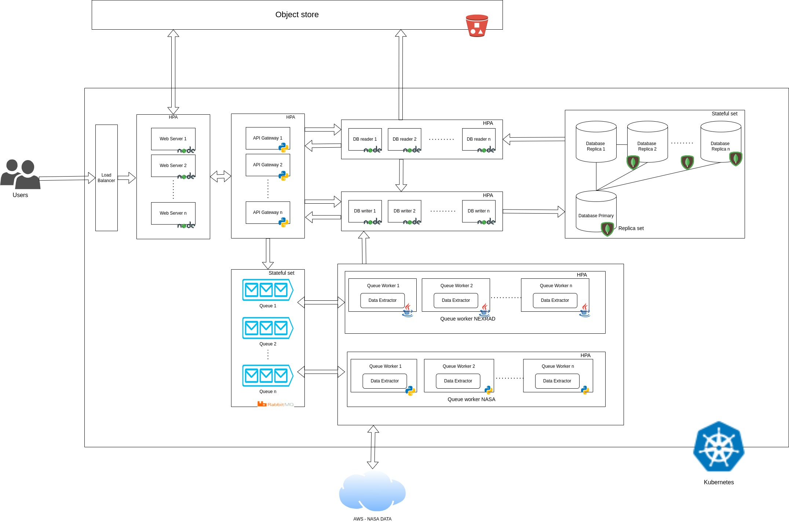

# garuda

Spring 2022 Project

Application to visualises user requested [NEXRAD](https://www.ncei.noaa.gov/products/radar/next-generation-weather-radar) data.

## Run

#### Start Application

```sh

docker-compose up

```

Run the above command on your terminal from root of project folder to create all the resources to run the project.

> Note: You'll need latest version of docker engine

> Note: The above command creates 6 containers for the running the application.

> Note: The services run in non-detached mode. On exiting the process from terminal all the containers stop.

#### Access Web-Application

URL for the web-application: http://localhost:3000

#### Stop Application

> Type : CTLR + C to exit

#### Clean Created Resources

```sh

docker-compose down

```

## Modules

1. [Data Extractor](./data_extractor/README.md) : Apache Maven project to build a utility JAR file which extracts requested NEXRAD data from S3.

2. [Queue Worker](./queue_worker/README.md) : Apache Maven project to build a JAR file which runs a consumer on a rabbitmq queue. It processes the request using data_extractor utitlity JAR and published the data to a API endpoint.

3. [DB_Middleware](./db_middleware/README.md): Microservice to interact with database. This microservices provides APIs to perform read and writes to database. Reads are performed by API_Gateway module and Writes are performed by Queue_Worker module and API_Gateway module.

4. [API_Gateway](./apigateway/README.md): API_Gateway module provides a middle-ware layer for all the back-end services. Front-end application communicate with API_Gateway module to interact with all other micro-services.

5. [Web_App](./web_app/README.md): Web Application module is the application with which the end users interacts. It communicates with API_Gateway module to maintain user data and fetch NEXRAD data.

## Architecture



## Developers

- Pranav Palani Acharya
- Rishabh Deepak Jain
- Tanmay Dilipkumar Sawaji
