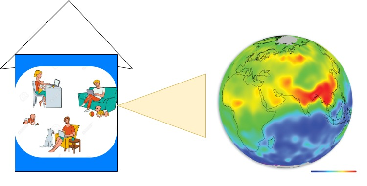

# Garuda

Spring 2022 Project

Application to visualises user requested [NEXRAD](https://www.ncei.noaa.gov/products/radar/next-generation-weather-radar) data.

## Run on UNIX based systems

#### Dependency/Prerequisite

Softwares/prerequisites needed to run garuda: [Docker](https://docs.docker.com/engine/install/)

> Note: You'll need latest version of docker engine

#### Start Application

```sh
docker-compose up
```

Run the above command on your terminal from the root of project folder to create all the resources to run the project.

> Note: The above command creates 6 containers for the running the application.

> Note: The services run in non-detached mode. On exiting the process from terminal all the containers stop.

> Note: This command might take some time to run. It's spinning up all the containers required to run the project. After all the resources are done loading, logs won't be printing on the terminal. You can use the application now !

#### Access Web-Application

URL for the web-application: http://localhost:3000

#### Stop Application

> Type : CTLR + C to exit

#### Clean Created Resources

Done playing around ? Run this command to remove all the created resources.

```sh

docker-compose down

```

#### Build

Build resource again if needed

```sh
docker-compose build
```

## Run on Windows based systems

#### Dependency/Prerequisite

Softwares/prerequisites needed to run garuda: [Docker](https://docs.docker.com/desktop/windows/install/)

> Note: You'll need latest version of docker for windows

#### Start Application

```sh
docker compose up
```

Run the above command on your cmd from the root of project folder to create all the resources to run the project.

> Note: The above command creates 6 containers for the running the application.

> Note: The services run in non-detached mode. On exiting the process from terminal all the containers stop.

> Note: This command might take some time to run. It's spinning up all the containers required to run the project. After all the resources are done loading, logs won't be printing on the terminal. You can use the application now !

#### Access Web-Application

URL for the web-application: http://localhost:3000

#### Stop Application

> Type : CTLR + C to exit

#### Clean Created Resources

Done playing around ? Run this command to remove all the created resources.

```sh

docker compose down

```

#### Build

Build resource again if needed

```sh
docker compose build
```

## Modules

1. [Data Extractor](./data_extractor/README.md) : Apache Maven project to build a utility JAR file which extracts requested NEXRAD data from S3.

2. [Queue Worker](./queue_worker/README.md) : Apache Maven project to build a JAR file which runs a consumer on a rabbitmq queue. It processes the request using data_extractor utitlity JAR and published the data to a API endpoint.

3. [DB_Middleware](./db_middleware/README.md): Microservice to interact with database. This microservices provides APIs to perform read and writes to database. Reads are performed by API_Gateway module and Writes are performed by Queue_Worker module and API_Gateway module.

4. [API_Gateway](./apigateway/README.md): API_Gateway module provides a middle-ware layer for all the back-end services. Front-end application communicate with API_Gateway module to interact with all other micro-services.

5. [Web_App](./web_app/README.md): Web Application module is the application with which the end users interacts. It communicates with API_Gateway module to maintain user data and fetch NEXRAD data.

## Architecture


## Napkin Diagram



## CI/CD

- **CI** : Github Action workflow is used as CI. Any pull request/ commit to main branch triggers CI workflow. [Garuda_CI](./.github/workflows/garuda__github_actions_CI.yml)

- **CD** :

  1.  Github Pages is used to deploy [data_extractor](./data_extractor/README.md)'s [javadocs](https://courses.airavata.org/garuda/data_extractor/index.html).

  2.  Github Pages also host static assets. docs/ folder is hosted via GitHub Pages.

  3.  CD is triggered on each push to master branch.

## Packages / Distribution builds

[Garuda's Data Extractor Maven Package](https://github.com/airavata-courses/garuda/packages/1236747)

## Developers

- Pranav Palani Acharya

- Rishabh Deepak Jain

- Tanmay Dilipkumar Sawaji
