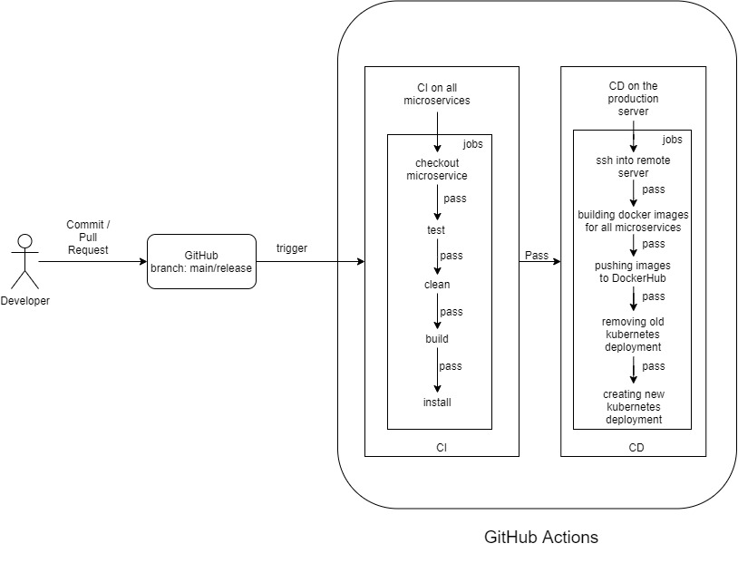

# Garuda

Spring 2022 Project

Application to visualises user requested [NEXRAD](https://www.ncei.noaa.gov/products/radar/next-generation-weather-radar) data.

## Run on UNIX based systems

#### Dependency/Prerequisite

Softwares/prerequisites needed to run garuda: [Docker](https://docs.docker.com/engine/install/)

> Note: You'll need latest version of docker engine

#### Start Application

Export ENV variables
```sh
export $PROJECT=PROJECT3
```

Pull the latest images from DockerHub

```sh
docker-compose pull
```

Start application services

```sh
docker-compose up
```
Run the above command on your terminal from the root of project folder to create all the resources to run the project.


### Adding hostnames in /etc/hosts
```sh
sudo sh scipts/host.sh
```

> Note: The above command creates 6 containers for the running the application.

> Note: The services run in non-detached mode. On exiting the process from terminal all the containers stop.

> Note: This command might take some time to run. It's spinning up all the containers required to run the project. After all the resources are done loading, logs won't be printing on the terminal. You can use the application now !

#### Access Web-Application

URL for the web-application: http://garuda.org:3000

#### Stop Application

> Type : CTLR + C to exit

#### Clean Created Resources

Done playing around ? Run this command to remove all the created resources.

```sh

docker-compose down

```

#### Build

Build resource again if needed

```sh
docker-compose build
```
> Note: Before building make sure you have these env variables exported in terminal
>  1. NASA_USERNAME - NASA MERRA2 dashboard username
>  2. NASA_PASSWORD - NASA MERRA2 dashboard password
>  3. AWS_ACCESS_KEY_ID - JetStream Object Store access key ID
>  4. AWS_SECRET_ACCESS_KEY - JetStream Object Store access secret
>  5. PROJECT - Version of project you want to build

## Run on Windows based systems

#### Dependency/Prerequisite

Softwares/prerequisites needed to run garuda: [Docker](https://docs.docker.com/desktop/windows/install/)

> Note: You'll need latest version of docker for windows

#### Start Application

Export ENV variables
```sh
export $PROJECT=PROJECT3
```

Pull the latest images from DockerHub

```sh
docker-compose pull
```

Start application services

```sh
docker-compose up
```

Run the above command on your cmd from the root of project folder to create all the resources to run the project.

### Adding hostnames in /etc/hosts
```sh
sudo sh scipts/host.sh
```

> Note: The above command creates 6 containers for the running the application.

> Note: The services run in non-detached mode. On exiting the process from terminal all the containers stop.

> Note: This command might take some time to run. It's spinning up all the containers required to run the project. After all the resources are done loading, logs won't be printing on the terminal. You can use the application now !


#### Access Web-Application

URL for the web-application: http://garuda.org:3000

#### Stop Application

> Type : CTLR + C to exit

#### Clean Created Resources

Done playing around ? Run this command to remove all the created resources.

```sh

docker compose down

```

#### Build

Build resource again if needed

```sh
docker compose build
```

> Note: Before building make sure you have these env variables exported in terminal
>  1. NASA_USERNAME - NASA MERRA2 dashboard username
>  2. NASA_PASSWORD - NASA MERRA2 dashboard password
>  3. AWS_ACCESS_KEY_ID - JetStream Object Store access key ID
>  4. AWS_SECRET_ACCESS_KEY - JetStream Object Store access secret
>  5. PROJECT - Version of project you want to build

## Access JetStream production deployment

Add changes in etc/hosts/ for production url
```sh
sudo sh scipts/prod_host.sh
```

Install CORS plugin in browser to enable cors headers since application is using jetstream object strore
[sample cors plugin](https://chrome.google.com/webstore/detail/allow-cors-access-control/lhobafahddgcelffkeicbaginigeejlf?hl=en)

Access application at http://garuda.org

## Modules

1. [Data Extractor](./data_extractor/README.md) : Apache Maven project to build a utility JAR file which extracts requested NEXRAD data from S3.

2. [Queue Worker](./queue_worker/README.md) : Apache Maven project to build a JAR file which runs a consumer on a rabbitmq queue. It processes the request using data_extractor utitlity JAR and published the data to a API endpoint.

3. [DB_Middleware](./db_middleware/README.md): Microservice to interact with database. This microservices provides APIs to perform read and writes to database. Reads are performed by API_Gateway module and Writes are performed by Queue_Worker module and API_Gateway module.
It also dumps the dataset of the request to the object store (AWS S3 bucket) and saves the object url in the database

4. [API_Gateway](./apigateway/README.md): API_Gateway module provides a middle-ware layer for all the back-end services. Front-end application communicate with API_Gateway module to interact with all other micro-services.

5. [Web_App](./web_app/README.md): Web Application module is the application with which the end users interacts. It communicates with API_Gateway module to maintain user data and fetch NEXRAD data.

6. [Queue Worker Nasa](./queue_worker_nasa/README.md) : Python application which runs a consumer on a rabbitmq queue. It processes the request using extractor utitlity and published the data in a conerted formatted to a API endpoint.

## Optimization
In the project 3 milestone after brainstorming we found scope for improvement in our system through which we reduced load from the backend significantly. The improvement was to store request dataset to the object-store(AWS S3 bucket) and then web app retrieves the data from the object store whenever user requests to plot the map. To check the systems performance with and without object store. We benchmarked the system with JMeter by making 100 concurrent request.
The average response time in without object store was 14194ms and in with object store was 399ms.
The average response time was reduced by <b> 135% <b>.
The details of the reports are present [here](https://courses.airavata.org/garuda/Architecture_analysis_case_study/Optimization%20using%20object-store.pdf)
 
## Architecture


## Napkin Diagram


## CI/CD

- **CI** : Github Action workflow is used as CI. Any pull request/ commit to main branch triggers CI workflow. [Garuda_CI](./.github/workflows/garuda__github_actions_CI.yml)

- **CD** :

  1.  Github Pages is used to deploy [data_extractor](./data_extractor/README.md)'s [javadocs](https://courses.airavata.org/garuda/data_extractor/index.html).

  2.  Github Pages also host static assets. docs/ folder is hosted via GitHub Pages.

  3.  CD is triggered on each push to master branch.

  4.  CD logs into JetStream2 remote server, builds all the docker images, pushes the docker images to DockerHub, replaces old deployments with latest deployments on remote kubernetes cluster.



## Packages / Distribution builds

[Garuda's Data Extractor Maven Package](https://github.com/airavata-courses/garuda/packages/1236747)

## Developers

- Pranav Palani Acharya

- Rishabh Deepak Jain

- Tanmay Dilipkumar Sawaji
